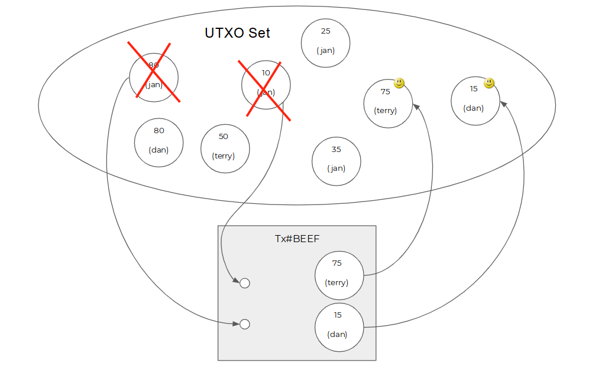
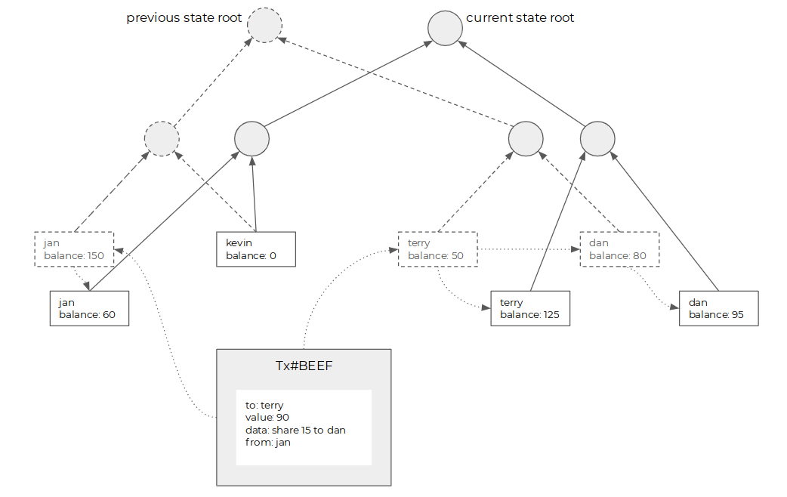
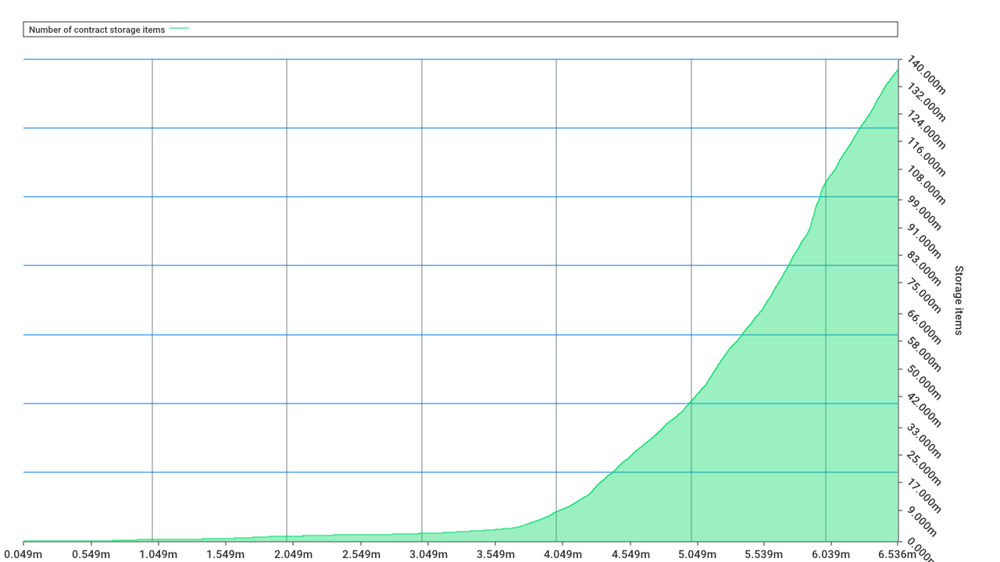

> If Layer 1 should be focused on state rather than calculation, then we need to understand what the state of the blockchain is when designing Layer 1. Only by understanding what the state is, can we understand what the state explosion is.

## STATE

After running for a period of time in the blockchain network, each full node leaves some data on the local storage. We can divide them into two categories：

- History - Block data and transaction data are historical, and history is the path from Genesis to the current state.

- State (the present) - The final result of the node after processing all the blocks and transactions from Genesis to the current height. The state has been changing with the increase of the block, and transaction is the cause of the change.

The role of the consensus protocol is to ensure that the current state seen by each node is the same through a series of message exchanges. To achieve this goal, the system has to make sure the history seen by each node is the same. 

As long as the history is the same (that is, all transactions are sorted in the same order) and the transactions are processed in the same way（the transactions are processed in the same deterministic virtual machine), then the current state of the transaction is obviously the same. When we say that "Blockchain is immutable", it refers to the fact that the history of blockchains cannot be tampered with. But in fact, the state of the blockchain is constantly changing.

The  interesting thing is, all kinds of blockchains have different ways to preserve its history and state, and those differences formed their own characteristics. Since the topic discussed in this article is state, and the historical data affecting the state is mainly the transaction (rather than the block header), the following discussion of history will focus on transactions instead of block headers.

## Example of Bitcoin

The state of Bitcoin refers to the current state of the Bitcoin ledger. The state of Bitcoin consists of all UTXO (unused transaction output). Each UTXO represents specified amount of Bitcoins and each UTXO has its’ own name (scriptPubkey) to record the owner. For an analogy, Bitcoin's current state just like a bag full of golden coins, and each coin was engraved with the name of the owner.

Bitcoin's history consists of a series of transactions which include input and output. The way to change the state of a transaction is to mark some UTXO (those referenced by the transaction input) contained in the current state as spent and remove them from the UTXO collection, and then add some new UTXO (the output of this transaction) to this collection.

From the diagram, we can see that Bitcoin Transaction Output(TXO, Transaction Output) is exactly the UTXO mentioned above. UTXO is just a TXO at a special stage (not yet spent). The components that make up the Bitcoin state (UTXO) are also the components that make up the transaction (TXO), thus Bitcoin has an amazing feature: The state at any moment is a subset of history, and the data types contained in history and state are of the same dimension. The history of transaction (the set of all packaged transactions, that is the set of all generated TXOs) is  the history of the state (the set of UTXO collections for each block, also the collection of all generated TXOs) and the history of Bitcoin only include transactions.

In the Bitcoin network, each block and each UTXO continue to occupy the node's storage space. At present, [the size of Bitcoin's entire history (the size of all blocks combined) is about 200G](https://www.blockchain.com/en/charts/blocks-size), [and the size of state is only ~3G (consisting of ~50 million UTXO components)](https://statoshi.info/dashboard/db/unspent-transaction-output-set). Bitcoin manages the historical growth rate well by limiting each block size. Due to the subset relationship between its history and state,the size of the state data must be much smaller than that of the historical data. Therefore, the state growth is also indirectly managed by block size.

## Example of Ethereum

Ethereum’s state, also known as world state, is the Ethereum ledger’s current state. Ethereum’s state is a Merkle tree constructed from nodes of hashes (each leaf node is an account). Each account stores both the account balance (the amount of ether) and smart contract data (e.g. data for a cryptokitty). Ethereum’s state can be viewed as a long ledger,  and the first column contains account name, the second column contains account balance and the third column contains smart contract data on this ledger .

Ethereum’s history is also constructed from transactions, a simplified view of a transaction’s internal structure is:

- to - destination address, could be account or contract address

- value - the amount of ether to transfer

- data - the data carried by the transaction

The way a transaction modifies the state works like this, EVM finds the transaction’s destination account:

1. Calculating new balance of destination account based on the transaction value

2. Transfer the payload data of transaction to the target smartcontract and the smartcontract would execute the logics stored in the contract and use this received data as input for the contract. During the execution, any account’s state (contract or EOA) could be modified and updated to a new state.

3. Construct new leaf node to store the new state, and update the Merkle tree.

As we have shown, Ethereum’s history and transaction structure is very different compared to Bitcoin. Ethereum’s state is constructed from accounts, and a transaction is made up of information that triggers account modification. The state and transaction each records completely different kinds of data, so there is no superset or subset relationship between them, which means history and state includes data from two different dimensions, and transaction history size and state size does not have any causal relationship. 

After a transaction modified the state, not only new state is created (the leaf nodes with solid line), but old state is also stored (the leaf nodes with dashed line) as historical states, thus Ethereum’s history contains both transactions and historical states. Because history and state belongs to different dimensions, Ethereum’s block headers include both merkle root containing transactions and merkle root containing state. (Bonus points: EOS uses a model similar to Ethereum’s account model, but the block header doesn’t include Merkle Tree Root containing state, is this a good thing or not?)

In Ethereum, every block and every account will continuously occupy a node’s disk space. Ethereum nodes have many different modes of syncing, and all history and state are saved under Archive mode. History includes transaction history and state history, and the total amount of data has surpassed 2 TB; Under default mode, historical state is pruned, only transaction history and current state is stored locally, so the total data size is about 170 GB, where transaction history is about 160 GB and current state is about 10 GB. 

All cost in Ethereum is managed by the gas fee model, different transaction size consumes corresponding gas. And the gas consumed by each EVM instruction not only takes into account the computational overhead, but also takes into account the storage overhead. Through the gaslimit of each block, the growth rate of history and state is indirectly limited.

P.S. A common misunderstanding is that, Ethereum’s “blockchain size” is already larger than 1 TB. But from the above analysis we can see that “blockchain” size is a very vague definition.If we counted including historical state, then it is indeed more than 1 TB. 

But for full nodes, discarding the historical states does not cause any problem. Because every historial state can be recalculated (without considering the computation time) as long as there is the Genesis and transaction history. The real meaningful data is the amount of data that must be stored on a full node, for Bitcoin it’s 200 GB, for Ethereum it’s 170 GB. They are basically in the same amount, an this amount of data can be easily stored on a regular cloud host. So people’s observation that the number of Ethereum full nodes is decreasing is not due to the increasing storage need (the root cause is the cost of computation during syncing, but we’ll not go into too much details here). Considering Ethereum’s historical length (the gap between the current block timestamp and the genesis block timestamp) is less than half of bitcoin, we can see that Ethereum’s history and state growth is much faster.

## The Tragedy of (Storage) Commons :

Tragedy of the commons is a term used to describe a situation where individual users with no restriction will deplete a system’s common resource.  blockchain nodes share their disk space to store transactions and states. This is precisely a kind of common resource.

(Storage all the nodes pay for saving history and state in a blockchain system is such a common resource. )

Blockchain nodes use three types of resources to process transactions: CPU, disk space and network bandwidth. CPU and bandwidth are resources that each block will refresh. We can think that there are as many CPUs and bandwidths available in each block interval. It means the previous block’s CPU and bandwidth consumption will not affect the amount of CPU and bandwidth in the next block. 

For these kind of refreshable resources, we can compensate the node with a one-time transaction fee (for the correlation between handling fee and calculation complexity and transaction size, please refer to RFC0015 Appendix 1).

Different with CPU and network bandwidth, disk space is a long-term occupied resource. The disk space occupied of one block can not be used by a later user unless it is released by the previous owner. A node will continuously keep the occupied disk space alive but the user of the occupied space doesn’t have to pay rent (keep in mind transaction fees are only a one time payment). It means users only have to make a small one time payment when writing data to the blockchain. Afterwards they essentially have permanent usage rights to a storage system with more availability than Amazon S3. This kind of infinite and permanent storage cost is shared by all the full nodes in the blockchain network.

Because all kinds of DApps operate on the Ethereum blockchain, the phenomenon of The Tragedy of (Storage) Commons is more widespread in Ethereum. For example, at block 5700001 (May 30, 2018), the top 5 smart contracts ranked by storage usage are:

1. EtherDelta, 5.09%
2. IDEX, 4.17%
3. CryptoKitties, 3.05%
4. ENS, 1.92%
5. EOS Sale, 1.73%

The funny fact is the last one EOS Sale. Even though EOS Sale has already concluded and EOS tokens are already transacting on the EOS chain, the disk space used by EOS Sale has became a permanent part of an Ethereum full node, as a result part of a full node’s disk resource is continuously being wasted.

We can already observe that without management, intentional or not, blockchain’s disk space is being abused. 

In a well-designed economic model, the user should and must bear the cost of storage. This cost is not only proportional to the size of the occupied disk space, but also to the length of the occupied time.

## State Explosion

Both historical state or current state consume the storage resources. According to the analysis we can see that  (the state model of other blockchains can basically be summarized as one of them ) , although Bitcoin and Ethereum managed the growth of history and state,  but they didn't control the total size of historical state and current state, and the data will accumulate continually. In this way it will cost more and more disk space for a full node to run in the blockchain system, and more disk space means much more cost and requirement. Apparently this would make less miner run the full node and thus affect the decentralization of the blockchain. And this is the last thing we want to see.

You might ask is there any possibility that the improvement of the hardware will exceed the accumulation of historical state and current state? My answer is the possibility is very low.

We can see the growth of Ethereum network in this sheet, the amount of state accumulation has grown exponentially. Bitcoin has accumulated from 0 to 3GB in 10 years; But Ethereum has accumulated from 0 to 10GB in 4 years; The current situation is that we have not solved the Scalability problem of the blockchain yet, and that is, the growth rate is just under the condition of blockchain is still a niche technology.

When we solve the scalability problem, and the blockchain technology really gets mass adoption, we will have numbers of DApps and users, what speed will the blockchain historical state or current state accumulate?

This is the state explosion problem, we classify it as a post-scalability problem. Because it will emerge  obviously after solving the scalability problem. We noticed this problem when doing the permission chain project, because the performance of the permission chain is much higher than the public chain, and it’s just in the post-scalability phase. (Question : How to solve the state explosion problem in permission chain?)

Relatively speaking, handeling the accumulation of historical data is easy. We can compress these states by decentralized Checkpoint or zero-knowledge proof in the future. And we can even drop the historical state and still keep the blockchain running normally. Handel the accumulation of the current state is a lot more hard because it is the necessary data to run the full node.

Some Blockchain projects have seen this problem and proposed some solutions. EOS RAM is a useful attempt to solve the state explosion problem: RAM represents the available memory resources for the super node server, whether account, contract status or code should takes a certain amount of EOSRAM to run.

But the design of RAM also has problems. It needs to be purchased through the built-in trading market, it is not transferable, it cannot be rented, and the short-term memory demand in the contract execution process and the long-term storage requirement of the contract state are mixed together.

And the total amount of RAM has no fixed rules, it more depends on the hardware configuration that the super node can withstand, but not the cost of the consensus space.

Ethereum community also noticed this problem and proposed Storage Rent solution: requiring users to prepay a rent for the storage resources, which will continue to consume the rent when use the storage resource. The longer it takes, the more rent the user needs to pay.

But there are two problems with this Storage Rent solution:

- The prepaid rent will be used up one day, at that time how to handle the occupied status? To solve this problem, Storage Rent needs to be supplemented by mechanisms such as resurrection, which increases the complexity of the design, extremely reduces the immutability of the smart contract, and also bad for the user experience.

- Ethereum's state model is a shared model but not First-class State. Let’s take ERC20 Token as an example, the assets of all users record in the storage of a single ERC20 contract. In this case, who should pay the state rent?

Solving the state explosion problem is also one of the goals of Nervos CKB, for this purpose, CKB is taking a completely different way with much more changes. 

Originator (March 22, 2019) : [Jan Xie](https://talk.nervos.org/t/topic/1515)

Translator : Mingrui Jiang, JiaYi, Clare, Kryptohenry
